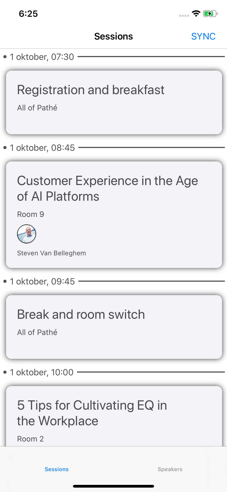

# Exercise 1 - Advanced Xamarin.Forms

## Goals for this exercise

- [Create a constistent look & feel on iOS and Android with a `Visual`](#1)
- [Replace existing `ListView` controls with the new `CollectionView`](#2)
- [Replace existing `NavigationPage` with `Shell` and leverage its features](#3)
- [Add an automatic `Dark Mode` feature to the app](#4)

## <a nane="1"></a> Visual

### Bootstrap

We need to add the Material visual theme to our application through Nuget. Install the following package in the `ConferenceApp`, `ConferenceApp.iOS` and `ConferenceApp.Android` projects:

```
Xamarin.Forms.Visual.Material
```

Next, the Material renderers and themes that are implemented in this package, need to be activated. This is done by adding an initialization call in the startup routines of the iOS and Android apps.

In the iOS `AppDelegate` class, find the `FinishedLaunching` method and add the following line, just after the call to `Forms.Init()`:

```csharp
global::Xamarin.Forms.FormsMaterial.Init();
```

In the Android `MainActivity` class, find the `OnCreate` method and add the following line, just after the call to `Forms.Init()`:

```csharp
global::Xamarin.Forms.FormsMaterial.Init(this, savedInstanceState);
```

### Using the Visual

In each XAML page of the application, find the root XAML node called `<ContentPage ...>` and add the following attribute:

```xml
Visual="Material"
```

This instruction lets Xamarin.Forms know that it has to apply the Material style to the controls on the page. If you do this during a debug session, you should see the application change in real time. The change is most dramatic on iOS:


The following pages should all be changed to create a consistent look & feel:

- `MainPage.xaml`
- `Content\Sessions\SessionsPage.xaml`
- `Content\Sessions\SessionDetailPage.xaml`
- `Content\Sessions\MySessionsPage.xaml`
- `Content\Speakers\SpeakersPage.xaml`
- `Content\Speakers\SpeakerDetailPage.xaml`

## <a nane="2"></a> CollectionView

`CollectionView` became generally available in Xamarin.Forms version 4.3. We will replace the existing `ListView` controls on both the `SessionsPage` and the `SpeakersPage` with this new `CollectionView` control.

Open the `SessionsPage.xaml` file and find the `<ListView>` element. Step by step, replace the `ListView` as follows:

1. Change the `<ListView>` XAML tag to a `<CollectionView>` with the following properties:

    ```xml
    <CollectionView
                    ItemsSource="{Binding SessionsGrouped}"
                    IsGrouped="True"
                    SelectionMode="Single"
                    SelectionChanged="NavigateToSession"
                    ItemSizingStrategy="MeasureAllItems"
                    SelectedItem="{Binding SelectedSession, Mode=TwoWay}">

                    <!-- leave the data template --> 

    </CollectionView>
    ```

    _This will replace the plain `ListView` with a `CollectionView` which has grouping enabled. The children of this `CollectionView` are now invalid, so we have to fix this._

The method signature of the `SelectionChanged` event is different from the `ListView`'s event. 

2. Therefore, go to `SessionsPage.xaml.cs` and change its implementation to:

    ```csharp
    async void NavigateToSession(object sender, SelectionChangedEventArgs e)
    {
        var session = e.CurrentSelection.FirstOrDefault() as Session;
        await Navigation.PushAsync(new SessionDetailPage(session.Id));
    }
    ```

3. Replace `<ListView.ItemTemplate>` with `<CollectionView.ItemTemplate>`

    _Since `CollectionView` doesn't use `ViewCell`s in favor of performance, we can remove the `<ViewCell>` from the view hierarchy in the `<DataTemplate>`:_

4. Remove the `<ViewCell>` and `</ViewCell>` tags

    _The `CollectionView` doesn't have a built-in pull-to-refresh behavior. As a replacement, we can use the general-purpose `RefreshView` control._

5. Wrap the entire `CollectionView` inside a `<RefreshView>` and add the following attributes:

    ```xml
    <RefreshView IsRefreshing="{Binding IsBusy}"
                        Command="{Binding ReloadSessionsCommand}">

    <!-- CollectionView goes here -->

    </RefreshView>
    ```

    _We now have our pull-to-refresh behavior back._

Since the new `CollectionView` uses grouping, we need to provide templates for the header and footer views of each group. In our case, the group header will display a starting time of a group of sessions.

6. Add the following definitions inside the `<CollectionView>` XAML tag:

    ```xml
    <CollectionView.GroupHeaderTemplate>
        <DataTemplate>
            <StackLayout Orientation="Horizontal" Padding="5">
                <Label Text="{x:Static styles:IconFont.Circle}" VerticalOptions="Center" FontFamily="{StaticResource FontAwesome}" FontSize="6" Style="{DynamicResource TextSubheadSecondary}"/>
                <Label Text="{Binding GroupName}" Style="{DynamicResource TextSubheadSecondary}" VerticalOptions="Center" />
                <BoxView HorizontalOptions="FillAndExpand" VerticalOptions="Center" Color="{DynamicResource TextSecondaryColor}" HeightRequest="2" />
            </StackLayout>
        </DataTemplate>
    </CollectionView.GroupHeaderTemplate>

    <CollectionView.GroupFooterTemplate>
        <DataTemplate>
            <!-- workaround for iOS bug where it shows a default view if there is no footer template -->
            <ContentView />
        </DataTemplate>
    </CollectionView.GroupFooterTemplate>
    ```

The list of sessions should now look like this:



On the `SpeakersPage`, we will go a little bit further. We will use a different layout here to display the speakers in a grid.

7. Replace the `ListView` on `SpeakersPage.xaml` with a `CollectionView`, performing similar steps as with the `SessionsPage.xaml`.

    _The `CollectionView` definition should now look like this:

    ```xml
    <RefreshView IsRefreshing="{Binding IsBusy}"
                Command="{Binding ReloadSpeakersCommand}">
        <CollectionView
                ItemsSource="{Binding Speakers}"
                SelectionMode="Single"
                SelectedItem="{Binding SelectedSpeaker, Mode=TwoWay}"
                ItemSizingStrategy="MeasureFirstItem"
                SelectionChanged="NavigateToSpeaker"
                Margin="10">

            <CollectionView.ItemTemplate>
                <DataTemplate x:DataType="models:Speaker">

                <!-- et cetera -->

                </DataTemplate>
            </CollectionView.ItemTemplate>
        </CollectionView>
    </RefreshView>
    ```

    >_The `CollectionView` will now still display speakers in a vertical list, but we want to have a grid. We can do this by adding an `ItemsLayout` to the `CollectionView` to override the default._

8. Inside the `<CollectionView>` XAML element, add a new `<CollectionView.ItemsLayout>` element:

    ```xml
    <CollectionView.ItemsLayout>
        <GridItemsLayout Orientation="Vertical"
                            Span="2"
                            HorizontalItemSpacing="10"
                            VerticalItemSpacing="10"
                            SnapPointsType="Mandatory"
                            SnapPointsAlignment="Start"
                            />
    </CollectionView.ItemsLayout>
    ```

    >_This will override the default layout of the `CollectionView` by displaying the items in a grid. The grid will still scroll vertically (`Orientation="Vertical"`), but we now have 2 speakers side-by-side because we set the `Span="2"` attribute. Using Hot Reload, you can experiment with different settings._

    >_In addition, we enabled *snap points* so that the `CollectionView` always aligns the items in view to the top when scrolling._
    
### CollectionView Bonus Exercise

As a bonus exercise, we can add a special view to the `CollectionView` which is shown when there are no items to be displayed. This is the so called `EmptyView`. In this view we can display a friendly message to indicate that the items are being loaded, or that there are no items to be displayed.

9. Inside the `<CollectionView>` XAML element, add a new `<CollectionView.EmptyView>` element:

    ```xml
    <CollectionView.EmptyView>
        <StackLayout HorizontalOptions="FillAndExpand"
                        VerticalOptions="FillAndExpand">
            <Label Style="{DynamicResource TextHeadLine}"
                    HorizontalOptions="Fill"
                    VerticalOptions="CenterAndExpand"
                    HorizontalTextAlignment="Center"
                    Text="Loading speakers..."
                    IsVisible="{Binding IsBusy}"/>

            <Label Style="{DynamicResource TextHeadLine}"
                    HorizontalOptions="Fill"
                    VerticalOptions="CenterAndExpand"
                    HorizontalTextAlignment="Center"
                    Text="There are no speakers here :("
                    IsVisible="{Binding IsBusy, Converter={StaticResource InvertedBooleanConverter}}"/>
        </StackLayout>
    </CollectionView.EmptyView>
    ```

    >_The first label will be shown while the list is loading. Its visibility is controlled by the `IsBusy` property of the page's view model. The second label will be shown when there view model finishes loading, but there is still no data. This is controlled by the `IsBusy` property too, however we are using an `InvertedBooleanConverter` here to make it visible when `IsBusy == false`_

The speakers page should now look like this:


## <a nane="3"></a> Shell

The Starter solution uses a standard `TabbedPage` as its `MainPage`. Each tab hosts a `NavigationPage` with the `SessionsPage` and the `SpeakerPage` respectively. By default in Xamarin.Forms, we have to navigate between pages using the page's `Navigation` property. Many MVVM developers find this limiting, as they want to do view model navigation. For that reason, they usually switch to an MVVM framework like MvvmCross, MvvmLight or Prism.Forms.

The new Xamarin.Forms `Shell` can simplify navigation greatly and offers us the ability do navigate through the app using URI's. Furthermore, it allows us to define the app's navigation structure in a much more declarative way.

Let's first replace the `MainPage` with a `Shell`:

1. There is no Visual Studio template for a Shell XAML resource, so we need to add a new XAML Content Page first. Add a new XAML Content Page to the root of the `ConferenceApp` project, named `AppShell.xaml`.
2. In the XAML file, replace `ContentPage` with `Shell`, and in the code behind, replace the base `ContentPage` class with `Shell` as well. We will also bring in some XML namespaces to help us further define the shell:

    ```xml
    <Shell xmlns="http://xamarin.com/schemas/2014/forms"
        xmlns:x="http://schemas.microsoft.com/winfx/2009/xaml"
        xmlns:d="http://xamarin.com/schemas/2014/forms/design"
        xmlns:mc="http://schemas.openxmlformats.org/markup-compatibility/2006"
        xmlns:sessions="clr-namespace:ConferenceApp.Content.Sessions"
        xmlns:speakers="clr-namespace:ConferenceApp.Content.Speakers"
        xmlns:local="clr-namespace:ConferenceApp.Views"
        xmlns:styles="clr-namespace:ConferenceApp.Styles"
        xmlns:ios="clr-namespace:Xamarin.Forms.PlatformConfiguration.iOSSpecific;assembly=Xamarin.Forms.Core"
        mc:Ignorable="d" Title="ConferenceApp"
        x:Class="ConferenceApp.AppShell">

    <!-- ... -->

    </Shell>
    ```

3. Define the structure of our application in the `AppShell` XAML code:

    ```xml
    <TabBar>
        <Tab Title="Sessions">
            <Tab.Icon>
                <FontImageSource FontFamily="{StaticResource FontAwesome}"
                                 Glyph="{x:Static styles:IconFont.Calendar}"
                                 Size="18"
                                 Color="White"/>
            </Tab.Icon>
            <ShellContent Title="All Sessions" Route="sessions" ios:NavigationPage.IsNavigationBarTranslucent="True" ContentTemplate="{DataTemplate sessions:SessionsPage}" />
        </Tab>
        <Tab Title="Speakers">
            <Tab.Icon>
                <FontImageSource FontFamily="{StaticResource FontAwesome}"
                                 Glyph="{x:Static styles:IconFont.UserFriends}"
                                 Size="18"
                                 Color="White"/>
            </Tab.Icon>
            <ShellContent Route="speakers" ios:NavigationPage.IsNavigationBarTranslucent="True" ContentTemplate="{DataTemplate speakers:SpeakersPage}" />
        </Tab>
    </TabBar>
    ```

    >This will give us the two tabs for Sessions and Speakers. Furthermore, Shell will make sure that there is a navigation context, so we don't have to wrap anything inside a `NavigationPage` anymore.

    >Also note that we added some nice icons using the `FontImageSource` and the `Font Awesome` icon font. We will come back to the other properties later.

    >The `AppShell` will now look rather bland, so we want to give it some styling.

4. Add a `ResourceDictionary` to the `AppShell`, in which we will override the styling properties offered by the Xamarin.Forms `Shell`:

    ```xml
    <Shell.Resources>
        <ResourceDictionary>
            <Style x:Key="BaseStyle" TargetType="Element">
                <Setter Property="Shell.BackgroundColor" Value="{DynamicResource NavigationBackground}"/>
                <Setter Property="Shell.ForegroundColor" Value="{DynamicResource TextNavigationColor}" />
                <Setter Property="Shell.TitleColor" Value="{DynamicResource TextNavigationColor}"/>
                <Setter Property="Shell.UnselectedColor" Value="{DynamicResource ElementUnSelectedColor}" />
                <Setter Property="Shell.TabBarBackgroundColor" Value="{DynamicResource NavigationBackground}" />
                <Setter Property="Shell.TabBarForegroundColor" Value="{DynamicResource TextNavigationColor}" />
                <Setter Property="Shell.TabBarTitleColor" Value="{DynamicResource ElementSelectedColor}" />
                <Setter Property="Shell.TabBarUnselectedColor" Value="{DynamicResource ElementUnSelectedColor}" />
            </Style>
            <Style TargetType="TabBar" BasedOn="{StaticResource BaseStyle}" />
        </ResourceDictionary>
    </Shell.Resources>
    ```

    >Notice that we are using `DynamicResource` for the colors here. This is because we want to be able to switch colors at runtime later. This will style our `AppShell` the way we want it. The colors are defined in the `Styles/LightTheme.xaml` file in the `ConferenceApp` project.

Now that the basic `AppShell` is in place, we can get rid of the original `MainPage`.

5. Delete `MainPage.xaml` from the `ConferenceApp` project. 
6. In `App.xaml.cs`, make sure that the `MainPage` property is set to a new instance of the `AppShell` class we just made:

    ```csharp
    MainPage = new AppShell();
    ```
7. Test the app, and see that it now displays the tabs in the Shell.


Navigation is now still done using page-to-page navigation. Instead, we would like to benefit from the URI based navigation provided by the `Shell`.

First, we have to define the so-called URI-routes, which should map to the pages in our application, so that `Shell` knows which pages to load.

8. In `AppShell.xaml.cs`, add the following method:

    ```csharp
    void RegisterRoutes()
    {
        Routing.RegisterRoute("sessions", typeof(SessionsPage));
        Routing.RegisterRoute("mysessions", typeof(MySessionsPage));
        Routing.RegisterRoute("sessiondetail", typeof(SessionDetailPage));
        Routing.RegisterRoute("speakers", typeof(SpeakersPage));
        Routing.RegisterRoute("speakerdetail", typeof(SpeakerDetailPage));
    }
    ```
    
    And call this method from the `AppShell`'s constructor:

    ```csharp
    public AppShell()
    {
        InitializeComponent();
        RegisterRoutes();
    }
    ```

Now we can navigate to a `SessionDetailPage` from anywhere, using the `sessions` route. We can even create deep links, for which `Shell` will build up a navigation stack, like: `/sessions/sessiondetail`.

Before we can do this, we need to change how the `SessionDetailPage` and the `SpeakerDetailPage`, and their respective view models, are loaded. We can pass query string parameters in the navigation URI, to indicate which session or speaker to load.

9. In `SessionDetailViewModel.cs`, decorate the class with a new attribute:

    ```csharp
    [QueryProperty(nameof(SessionId), "sessionId")]
    public class SessionDetailViewModel : BaseViewModel
    {
        // et cetera
    }
    ```

    >This property will let `Shell` know that it can pass the value of a URI parameter to the property named `SessionId` in the `SessionDetailViewModel` after navigating to a certain route. Note that we can now pass the value directly to the view model, so that the page can remain "dumb".

10. Now we don't need the constructor parameter for the `SessionDetailViewModel` class anymore, so we can remove it:

    ```csharp
    public SessionDetailViewModel( /* no parameters */ )
    {
        conferenceStore = ShinyHost.Resolve<IConferenceStore>();
    }
    ```

And this will affect the `SessionDetailPage`, since it doesn't need to pass on the `sessionId` parameter anymore. 

11. Change its constructor to:

    ```csharp
    public SessionDetailPage()
    {
        BindingContext = new SessionDetailViewModel();
        InitializeComponent();
    } 
    ```

We can now go back to the `SessionsPage`, and move the navigation from the page's code behind to the `SessionsViewModel` class.

12. In `SessionsPage.xaml`, change the binding of the `CollectionView`, so that it uses a command instead of the `SelectionChanged` event:

    ~~`SelectionChanged="NavigateToSession`~~

    `SelectionChangedCommand="{Binding SelectSessionCommand}"`

13. Remove the `NavigateToSession` method from `SessionsPage.xaml.cs`.

We now have to implement the command we just bound to the `SelectionChangedCommand` property of the `CollectionView`.

14. In `SessionsViewModel`, add the following code to the class:

    ```csharp
    private IAsyncCommand selectSessionCommand;
        public IAsyncCommand SelectSessionCommand => selectSessionCommand ?? (selectSessionCommand = new AsyncCommand(NavigateToSession));

        private async Task NavigateToSession()
        {
            try
            {
                if (SelectedSession == null)
                    return;

                // this will reset the selected item, so that the item does not remain selected when the user navigates back to the collection view
                var session = SelectedSession;
                SelectedSession = null;

                await Shell.Current.GoToAsync($"sessiondetail?sessionId={Uri.EscapeDataString(session.Id)}");
            }
            catch (Exception ex)
            {
                Console.WriteLine(ex);
            }
    }
    ```

    >Note that we can now navigate from the view model using the `Shell.Current.GoToAsync()` method. The URI in this case is relative from the current page: `sessiondetail?sessionId=...`.

15. Test the app, the navigation between `SessionsPage` and `SessionDetailPage` should work as expected.

16. We need to do the same thing for the navigation between `SpeakersPage` and `SpeakerDetailPage`. See if you can figure out how to do this, following the same steps as we did with the sessions.

    >**Hint**

    >The `[QueryProperty]` attribute should map the `SpeakerId` property to the `speakerId` URI parameter.

We will add deep link navigation to the app in a later exercise.

## <a nane="4"></a> Dark Mode

At this moment, Xamarin.Forms does not offer an out-of-the box way to support _Dark Mode_, which is built into Android, and also in iOS 13. There are still ways to support this though. This exercise will introduce a method that lets you implement _Dark Mode_ now.

Currently, the app only uses a theme called `LightTheme`. It defines the basic colors for the default theme, which work well when the device is switched to _Day Mode_. However, these colors will look bad when the user switches to _Dark Mode_.

First we need to add a `DarkTheme`:

1. Add a new `ResourceDictionary` XAML resource to the `Styles` folder of the `ConferenceApp` project.

2. Add the colors for the Dark Mode to the dictionary:

    ```xml
    <?xml version="1.0" encoding="utf-8" ?>
    <ResourceDictionary xmlns="http://xamarin.com/schemas/2014/forms"
                xmlns:x="http://schemas.microsoft.com/winfx/2009/xaml"
                x:Class="ConferenceApp.Styles.DarkTheme"
                Source="DefaultTheme.xaml">
        <!-- this theme is based on the DefaultTheme resource dictionary -->

        <!-- Define the theme specific colors -->
        <Color x:Key="BackgroundColor">#000000</Color>
        <Color x:Key="NavigationBackground">#80000000</Color>
        <Color x:Key="ElementSelectedColor">#0A84FF</Color>
        <Color x:Key="ElementUnSelectedColor">#8E8E93</Color>
        
        <Color x:Key="TextNavigationColor">#FFFFFFFF</Color>
        <Color x:Key="TextPrimaryColor">#B0FFFFFF</Color>
        <Color x:Key="TextSecondaryColor">#B0FFFFFF</Color>
        <Color x:Key="TextTernaryColor">#C8C8C8</Color>

        <Color x:Key="CardBackgroundColor">#FF333333</Color>

        <Color x:Key="SignalColor">#f63c52</Color>
    </ResourceDictionary>
    ```

    >The names of these color resources match those in the `LightTheme`, so we can switch them at runtime.

We now need a component which lets us switch between `LightTheme` and `DarkTheme`.

3. Add a class named `ThemeService` in the `Services` folder of the `ConferenceApp` project

    ```csharp
    public static class ThemeService
    {
        static string appTheme = nameof(LightTheme);

        public static void ApplyTheme(string theme)
        {
            try
            {
                switch (theme)
                {
                    case nameof(DarkTheme):
                        {
                            if (appTheme == nameof(DarkTheme))
                                return;

                            Application.Current.Resources = new DarkTheme();
                            appTheme = nameof(DarkTheme);
                        }
                        break;
                    case nameof(LightTheme):
                        {
                            if (appTheme == nameof(LightTheme))
                                return;

                            Application.Current.Resources = new LightTheme();
                            appTheme = nameof(LightTheme);
                        }
                        break;
                }
            }
            catch (Exception ex)
            {
                Console.WriteLine($"\t\t\tERROR applying theme {theme}: {ex.Message}");
            }
        }
    }
    ```

    >Notice that the `ThemeService` holds a static property with the current theme, and that the `ApplyTheme` method only changes the theme if it is different from the previous value kept in the `appTheme` field.

    >The switch happens by creating a new instance of the new theme and assigning it to the `App.Current.Resources`. Since all pages, and the `Shell` use `DynamicResource` for their styles and colors, this immediately triggers Xamarin.Forms to update the UI.

In order to determine the current theme of the app, we need to call into native API's for iOS and Android. Also, the hooks where a UI Mode switched is passed to an app are different between the operating systems.

#### Android

For **Android**, we can tap into the `MainActivity`'s lifecycle.

First, we need a method to determine the current UI Mode selected by the user on the OS level:

4. Add a new method called `GetOSTheme()` to the `MainActivity` class:

    ```csharp
    public string GetOSTheme(Configuration configuration)
    {
        //Ensure the device is running Android Froyo or higher because UIMode was added in Android Froyo, API 8.0
        if (Build.VERSION.SdkInt >= BuildVersionCodes.Froyo)
        {
            var uiModeFlags = configuration.UiMode & UiMode.NightMask;

            switch (uiModeFlags)
            {
                case UiMode.NightYes:
                    return nameof(DarkTheme);
                case UiMode.NightNo:
                    return nameof(LightTheme);
            }
        }

        // default theme
        return nameof(LightTheme);
    }
    ```

    >This method looks into the collection of configuration flags, whether the `UiMode.NightYes` flag is present. If so, then `DarkTheme` is selected. If not, then `LightTheme` is selected.

We need to subscribe to configuration changes to the `UiMode` of the Android OS.

4. In `MainActivity.cs`, add the `ConfigChanges.UiMode` flag to the `ConfigurationChanges` parameter of the `Activity` attribute:

    ```csharp
    [Activity( /* properties */, ConfigurationChanges = ConfigChanges.ScreenSize | ConfigChanges.Orientation | ConfigChanges.UiMode)]
    ```

    >This lets Android know that the app is interested to know about changes to the UI Mode.

5. In the `OnCreate` method, after the call to `LoadApplication(new App());`, add a call to the `ThemeService` to let it know the current UI Mode when the app starts up:

    ```csharp
    ThemeService.ApplyTheme(GetOSTheme(Resources.Configuration));
    ```

Now we also need to subscribe to changes to the UI Mode configuration.

6. Override the `OnConfigurationChanged` method in the `MainActivity`:

    ```csharp
    public override void OnConfigurationChanged(Configuration newConfig)
    {
        base.OnConfigurationChanged(newConfig);

        ThemeService.ApplyTheme(GetOSTheme(newConfig));
    }
    ```

#### iOS

In iOS, changes to the `UIUserInterfaceStyle` are passed to iOS `ViewController` which is currently visible. Therefore, we need to hook into the lifecycle of each page. We can do this by adding a custom renderer.

7. In the iOS app, add a new class named `PageRenderer` in the `Renderers` folder:

    ```csharp
    using System;
    using ConferenceApp.Services;
    using ConferenceApp.Styles;
    using UIKit;
    using Xamarin.Forms;
    using Xamarin.Forms.Platform.iOS;

    [assembly: ExportRenderer(typeof(ContentPage), typeof(ConferenceApp.iOS.Renderers.PageRenderer))]
    namespace ConferenceApp.iOS.Renderers
    {
        public class PageRenderer : Xamarin.Forms.Platform.iOS.PageRenderer
        {

        }
    }
    ```

First, we need a method for determining the current `UIUserInterfaceStyle` of the iOS device.

8. Add a private method named `GetCurrentTheme()` to the renderer:

    ```csharp
    private string CurrentTheme()
    {
        if (UIDevice.CurrentDevice.CheckSystemVersion(13, 0))
        {
            return TraitCollection.UserInterfaceStyle == UIUserInterfaceStyle.Dark
                ? nameof(DarkTheme)
                : nameof(LightTheme);
        }

        return nameof(LightTheme);
    }
    ```

We need to select an initial theme when the renderer is initialized:

8. Override the `OnElementChanged` method:

    ```csharp
    protected override void OnElementChanged(VisualElementChangedEventArgs e)
    {
        base.OnElementChanged(e);

        if (e.OldElement != null || Element == null)
        {
            return;
        }

        try
        {
            ThemeService.ApplyTheme(CurrentTheme());
        }
        catch (Exception ex)
        {
            System.Diagnostics.Debug.WriteLine($"\t\t\tERROR: {ex.Message}");
        }
    }
    ```

And finally, we need to subscribe to changes to the `UIUserInterfaceStyle` in the OS. We can override the `TraitCollectionDidChange` method of the renderer:

    ```csharp
    /// <summary>
    /// Called when the user changes dark/light mode while the app is running
    /// </summary>
    /// <param name="previousTraitCollection"></param>
    public override void TraitCollectionDidChange(UITraitCollection previousTraitCollection)
    {
        base.TraitCollectionDidChange(previousTraitCollection);

        if (TraitCollection.UserInterfaceStyle != previousTraitCollection.UserInterfaceStyle)
        {
            ThemeService.ApplyTheme(CurrentTheme());
        }
    }
    ```

Congratulations, you have modernized your Xamarin.Forms app to use the latest features!