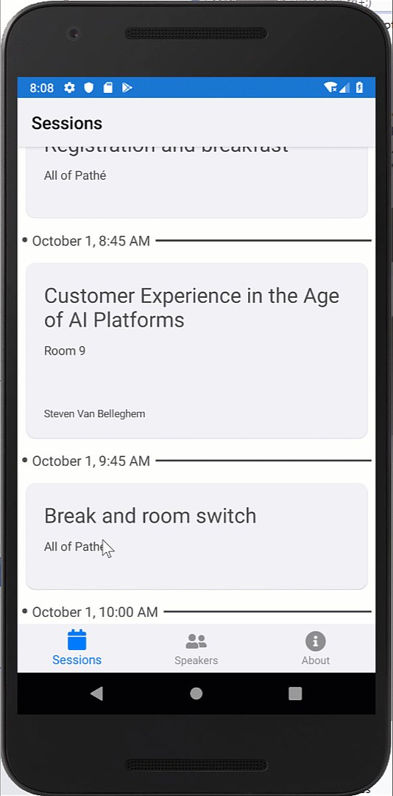

# Exercise 2 - Add Calendar integration to your app

In this hands-on lab we will add calendar integration to our app. this way an attendee can add a session they like to their agenda.

Goals for this lab: 
- [Create an abstraction for setting reminders](#1)
- [Create an Android specific implementation](#2)
- [Create an iOS specific implementation](#3)
- [Call the platform independend code to add reminders to your agenda ](#4)

## <a name="1"></a>1. Create an abstraction for setting reminders
We want to add the abillity to set a remonder when we have a session we like. a way to do this is by adding an entry in your default agenda that is on your phone. To abstract this interaction, we can create the following interface and add this to the `ConferenceApp.contracts` project.

``` C#
using System.Threading.Tasks;

namespace ConferenceApp.Reminders
{
    public interface ISetReminder
    {
        Task<bool> AddAppointment(MyAppointmentType appointment);
    }
}
```

we also create a class that abstracts away an appointment. We call this class `MyAppointmentType`

The class is defined as follows:
``` c#
public class MyAppointmentType
{
    public string Title { get; set; }
    public string WhereWhen { get; set; }
    public DateTime ExpireDate { get; set; }
    public string Description { get; set; }
}
```


Now we have all the abstractions in place to later call the platform specific implementation via the dependency service.

## <a name="2"></a>2. Create an Android specific implementation
The way we can implement interaction with the default app that is responsible for managing your calendar, is by starting an intent and let the operating system figure out which app is the default that can handle the data we make available.

Lets start by creating a folder that can contain all our platform specific service implementations. So we create a new folder in our Android project called `Services`

Next we create a new class and we call this class `SetReminderImpl` and we le tthis class inherit from the itnerface we just created. (This implies we need to set a reference to the project that contains the contract)

``` c#
public Task<bool> AddAppointment(MyAppointmentType appointment)
{
    // implementation will follow here
}
```

Now we need to provide an implementation. The way we can activate an application for a specific purpose is by creating and starting an intent. In our case we want to insert an appointment  in the agenda of the user of the phone.
For this we can create an intent with the action `adroid.intent.action.ISERT` 
This is done with the follwoing statement in c#

``` c#
Intent intent = new Intent(Intent.ActionInsert);
```

Next we need to provide data to the intent so the recieving application can create something it can store in it's own application context. For this we are using the option to call PutExtra() on the created intent and the provide it a set of name value pairs with data.

This is done with the following statements:
``` c#
intent.PutExtra(CalendarContract.Events.InterfaceConsts.Title, appointment.Title);
intent.PutExtra(CalendarContract.Events.InterfaceConsts.Description, appointment.WhereWhen + " " + appointment.Description);
intent.PutExtra(CalendarContract.Events.InterfaceConsts.Dtstart, GetDateTimeMS(appointment.ExpireDate));
intent.PutExtra(CalendarContract.Events.InterfaceConsts.Dtend, GetDateTimeMS(appointment.ExpireDate.AddHours(1)));
intent.PutExtra(CalendarContract.ExtraEventBeginTime, GetDateTimeMS(appointment.ExpireDate));
intent.PutExtra(CalendarContract.ExtraEventEndTime, GetDateTimeMS(appointment.ExpireDate.AddHours(1)));
intent.PutExtra(CalendarContract.Events.InterfaceConsts.EventTimezone, "UTC");
intent.PutExtra(CalendarContract.Events.InterfaceConsts.EventEndTimezone, "UTC");
```

Now we have all the data prepared, but now we need to tell the operating system, what do we expect it to choose. For this we use the `SetData()` method. We define we expect it to open an application that conforms to the `CalendarContract.Events` and that we specify where to find this contract at a given fixed Uri

This is done with the following c# statement:
``` c#
intent.SetData(CalendarContract.Events.ContentUri);
```
And finally we start the intent and return a TAsk with the boolean result success:

``` c#
 MainActivity.CurrentActivity.StartActivity(intent);
 return Task.FromResult(true);
 ```
You might have seen that we use an utillity function to create the correct datastructures to pass allong to the operating system This is the method `GetDateTimeMS`

Here is how that function works:

``` c#
long GetDateTimeMS(DateTime time)
{
    Calendar c = Calendar.GetInstance(Java.Util.TimeZone.Default);

    c.Set(Java.Util.CalendarField.DayOfMonth, time.Day);
    c.Set(Java.Util.CalendarField.HourOfDay, time.Hour);
    c.Set(Java.Util.CalendarField.Minute, time.Minute);
    c.Set(Java.Util.CalendarField.Month, time.Month);
    c.Set(Java.Util.CalendarField.Year, time.Year);

    return c.TimeInMillis;
}
```

Depending how you want to access this implementation we either use the Xamarin Forms Dependency Service or we use our own dependency injection framework of choice. In our case, we are using the `Shiny` container, so you can register the component in the `MainApplication` class. 

When you use the standard Xamarin Forms Dependency Service, you need to add the following attribute to our class definition:

``` C#
[assembly: Xamarin.Forms.Dependency(typeof(SetReminderImpl))]
```

The final step to add, is the indication that this application needs access to the calendar on the device. For this we use the Andoroid manfifest file and there we add the following xml snippet:

``` xml
	<uses-permission android:name="android.permission.WRITE_CALENDAR" />
```

And this concludes our Android implementation.

## <a name="3"></a>3. Create an iOS specific implementation
For iOS we also need to create a platform specific implementation. To follow good practice we also create a folder in our iOS project called Services.
In this folder we create a new class called `SetReminderImpl`

The iOS implementation interacts with the operating system build in `EventKit` API's. We need to ask access to the calendar of the user and after access is granted we can create a new event and then save this event in the calendar event store that is available.

First, we need to set a description for the usage of the calendar in the `info.plist` of the app. Add the following key:


Or in XML form:

```xml
<key>NSCalendarsUsageDescription</key>
<string>For adding session reminders to your calendar</string>
```

The component is implemented in the following way in iOS:

```c#
public async Task<bool> AddAppointment(MyAppointmentType appointment)
{
    var eventStore = new EventKit.EKEventStore();
    var granted = await eventStore.RequestAccessAsync(EKEntityType.Event);
    if (granted.Item1)
    {
        EKEvent newEvent = EKEvent.FromStore(eventStore);
        newEvent.StartDate = DateTimeToNSDate(appointment.ExpireDate);
        newEvent.EndDate = DateTimeToNSDate(appointment.ExpireDate.AddHours(1));
        newEvent.Title = appointment.Title; newEvent.Notes = appointment.WhereWhen;
        newEvent.Calendar = eventStore.DefaultCalendarForNewEvents;
        NSError e;
        return eventStore.SaveEvent(newEvent, EKSpan.ThisEvent, out e);
    }
    else
        return false;

}
```

Also in this cas we need to have a way to setup the correct data structures for date and time. This is done with a helper function called `DateTimeToNSDate`

The implementation for this function is as follows:

``` c#
public NSDate DateTimeToNSDate(DateTime date)
{
    if (date.Kind == DateTimeKind.Unspecified)
        date = DateTime.SpecifyKind(date, DateTimeKind.Local);
    return (NSDate)date;
}
```

And also here, if we are using the standard Xamarin Forms Dependency Service we need to add the following attribute to our class, or register it in the `Shiny` container in the `AppDelegate`'s `FinishedLaunching` method.

``` c#
[assembly: Xamarin.Forms.Dependency(typeof(SetReminderImpl))]
```

And that is it, we now have an android and iOS implementation to add a reminder to the agenda of the phone user. Now lets use this from our app.

## <a name="4"></a>4. Call the platform independend code to add reminders to your agenda

Our app has the option to show a list of Sessions and a List of speakers. From there we can alsway go into details. Let's add the option to add a session to our agenda from the `SessionDetail` screen.

In the `ConferenceApp` project, find the class `SessionDetailPage`. This class is the code behind for the xaml file `SessionDetailPage.xaml`

In the SessionDetailPage class you can see we initialize the page, by setting the binding context to the viewmodel. This viewmodel is of the type `SessionDetailViewModel`

We want to add a button to the User Interface and we want to handle the button using a command that is implemented in the ViewModel. For this to work we need to implement the handler for the button click as a ICommandHandler implementation.

Let us first add the required XAML to the page, so we get a button added to the page that we can click to add this to our agenda. This is done by adding a button definition to the Xaml definition of the page:

``` xml
        ... other xaml directives above
   </StackLayout>
</Frame>
    <Button Text="Add reminder to Calendar" Command="{Binding AddReminderToCalendar}"/>
</StackLayout>
```
In this markup you can see we defined a handler that will handle the click event. This handler must be created as an ICommand interface. The implementation needs to be in the binding context and this is the ViewModel.

So let's add to the viewmodel the comand handler. We want this handler to be called using async await semantics so our UI will not freeze the moment we call the eventhandler. This is done with the following code:

``` c#
private IAsyncCommand addReminderToCalendar;
public IAsyncCommand AddReminderToCalendar => addReminderToCalendar ?? (addReminderToCalendar = new AsyncCommand(SetReminder));

private async Task<bool> SetReminder()
{
    // implementation goes here
}
```

Now the final part is that we need to call our implementation that is device specific. LEts asume we use the standard Xamarin Forms Dependency Service then the code looks as follows:

``` c#
ISetReminder reminder = DependencyService.Get<ISetReminder>();
MyAppointmentType appointment = new MyAppointmentType();
appointment.Description = Session.Description;
appointment.Title = Session.Title;
appointment.WhereWhen = Session.Room;
appointment.ExpireDate = Session.StartsAt.AddMinutes(-5).DateTime;
return await reminder.AddAppointment(appointment);
```

As you can see we set the reminder 5 minutes before the start of the session.

Now build and run the application to see if you can add a session to the agenda available on your device.

The result on android should be something like this:




