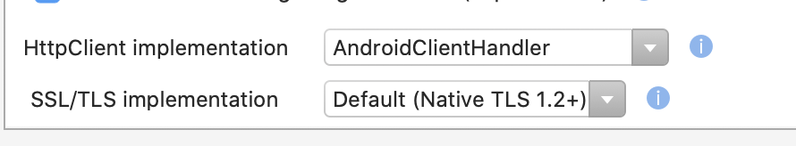
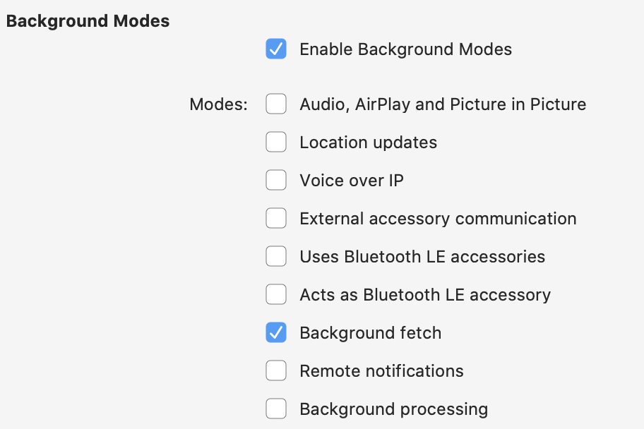

# Exercise 3 - Resilient Connected Apps

In this exercise, we will add more resiliency to the app, so we can handle situations with low or no connectivity.

## Goals for this exercise

- [Use Refit to get rid of boilerplate code](#1)
- [Make sure that we use the native HttpClient stack](#2)
- [Check for connectivity with Xamarin.Essentials](#3)
- [Add a retry mechanism with Polly](#4)
- [Add a background job to sync data](#5)

## <a nane="1"></a> Refit

The `ConferenceApiService` currently uses `HttpClient` directly to consume the conference API. While this works fine, this will lead to a large amount of repeated boilerplate code when you start to implement more and more methods who need to create and send the HTTP request, check the status code and deserialize the response. The `Refit` Nuget package can help us get rid of all this boilerplate code by offering a generated typed client for API's.

1. Add the `Refit` Nuget package to the `ConferenceApp`, `ConferenceApp.iOS` and `ConferenceApp.Android` projects.
2. Add a new interface named `IConferenceApi` to the `Services` folder in the `ConferenceApp` project:

    ```csharp
    using System.Collections.Generic;
    using System.Threading.Tasks;
    using ConferenceApp.Contracts.Models;
    using Refit;

    namespace ConferenceApp.Services
    {
        [Headers("Accept: application/json")]
        public interface IConferenceApi
        {
            [Get("/sessions")]
            Task<IEnumerable<Session>> GetSessions();
            [Get("/sessions/{sessionId}")]
            Task<Session> GetSession(string sessionId);
            [Get("/speakers")]
            Task<IEnumerable<Speaker>> GetSpeakers();
            [Get("/speakers/{speakerId}")]
            Task<Speaker> GetSpeaker(string speakerId);
        }
    }
    ```

    >The `[Get(...)]` attributes are markers for `Refit` so that it can map the interface methods to a REST API's endpoints. Note that you can also set `Headers` at the interface level, which will be sent with each request. `Refit` also offers extension points to inject authentication headers.

3. In the `Services/Startup.cs` file, add the following private fields to the `Startup` class:

    ```csharp
    private const string BASE_URI = @"https://conferenceapp-demo.azurewebsites.net/api";

    private static readonly HttpClient httpClient = new HttpClient { BaseAddress = new System.Uri(BASE_URI) };
    ```

    >Note that it is recommended practice to reuse the instance of an `HttpClient`. Therefore, we can instantiate it as a static field.

4. In the `ConfigureServices` method, add the registration of the generated `Refit` client for the `IConferenceApi` interface:

    ```csharp
    services.AddSingleton(p => RestService.For<IConferenceApi>(httpClient));
    ```

We can now consume the generated client in the `ConferenceApiService`:

    ```csharp
    public class ConferenceApiService : IConferenceApiService
    {
        // take a depencency on the IConferenceApi interface
        private readonly IConferenceApi conferenceApi;
        
        public ConferenceApiService(IConferenceApi conferenceApi)
        {
            this.conferenceApi = conferenceApi;
        }

        public async Task<IEnumerable<Session>> DownloadConferenceData(CancellationToken cancellationToken)
        {
            return await conferenceApi.GetSessions().ConfigureAwait(false);
        }
    }
    ```

Test the app and try the `SYNC` button on top of the `SessionsPage`. It should still execute the call to the Web Api.

## <a nane="2"></a> Native HTTP client stack

When you create a new Xamarin.Forms app, the default values for the HTTP client stack project settings are set to native. However, in an older app, this might not be the case. Therefore, it is always good to check whether these settings are correct.

>The native HTTP client stack is preferred for performance and security reasons.

1. Go into the project settings of the Android project
2. Under _Android Build_, verify the values of the `HttpClient implementation` and `SSL/TLS implementation`



>These should be: `AndroidClientHandler` and `Default (Native TLS 1.2+)`

3. Go into the project settings of the iOS project
4. Under _Android Build_, verify the value of the `HttpClient implementation` setting


>This should be: `NSUrlSession (iOS 7+)`

We recommend verifying these settings your existing Xamarin projects at your own office.

## <a nane="3"></a> Xamarin.Essentials.Connectivity

`Xamarin.Essentials` offers a cross platform `Connectivity` class, which we can use to determine the current network connectivity. Before we call the Web API, we should check whether the device is online, so that we don't waste resources on an HTTP call which is going to fail.

`Xamarin.Essentials` is already added to the application, so we don't have a add any new Nuget packages.

1. In `Services\SyncService.cs`, find the `SyncConferenceData` method
2. Add the following condition before the call to `conferenceService.DownloadConferenceData()`:

    ```csharp
    if (Connectivity.NetworkAccess == NetworkAccess.Internet)
    {
        // ...
    }
    ```

3. For Android, we need to add a permission request to the Android manifest: `AccessNetworkState`. Make sure that it is added:

    ```xml
	<uses-permission android:name="android.permission.ACCESS_NETWORK_STATE" />
    ```

This simple check will prevent us from trying to call the Web API when it is offline. You can use the `Connectivity` class anywhere in your Xamarin app, and also subscribe to changes to the network condition.

## <a nane="4"></a> Polly

Any network call done by an application poses many risks. We need to prepare for things going wrong. One of the things we can do is add an automatic retry mechanism in case we encounter a transient error (an error which might be gone when tried at a later moment).

Instead of building our own retry loops or circuit breakers, we can leverage the `Polly` Nuget package to do that for us, so we can focus on the business logic.

1. Add the `Polly` Nuget package to the `ConferenceApp` project
2. In `ConferenceApiService.cs`, add a new field to the `ConferenceApiService` class:

    ```csharp
    // Handles ApiExceptions with Http status codes >= 500 (server errors) and status code 408 (request timeout)
    private readonly AsyncRetryPolicy transientApiErrorPolicy = Policy
        .Handle<ApiException>(e => (int)e.StatusCode >= 500)
        .Or<ApiException>(e => e.StatusCode == HttpStatusCode.RequestTimeout)
        .WaitAndRetryAsync
        (
            retryCount: 3,
            sleepDurationProvider: retryAttempt => TimeSpan.FromSeconds(Math.Pow(2, retryAttempt))
        );
    ```

    >This defines a retry policy which triggers in case of a transient error (any server error with a status code >`500`, or in case of a request timeout - status code `408`). It will retry up to 3 times, with an increasing timespan between the retries.

3. Wrap the call to `conferenceApi.GetSessions()` in the retry policy:

    ```csharp
    return await transientApiErrorPolicy
        .ExecuteAsync(async () =>
        {
            Debug.WriteLine("Trying service call...");
            return await conferenceApi.GetSessions().ConfigureAwait(false);
        });
    ```

The `SYNC` feature should still work as expected.

You can trigger the retry policy by adding a parameter to the `GetSessions` method of the `IConferenceApi` interface:

    ```csharp
    [Headers("Accept: application/json")]
    public interface IConferenceApi
    {
        [Get("/sessions?injectError=true")]
        Task<IEnumerable<Session>> GetSessions();

        //...
    }
    ```

The API will now return a `500 Internal Server Error` with every call to the `/sessions` endpoint. You should then see that the retry policy retries the call 3 more times, before giving up.

>**Don't forget to remove the `injectError=true` parameter from the `IConferenceApi` interface!**

## <a nane="5"></a> Background job

Ideally, data in the app should already be up-to-date before the user opens the app. Both iOS and Android provide mechanisms to build background jobs that perform certain tasks such as downloading new content from an API. These mechanisms are very different per platform though.

The `Shiny.Core` Nuget library offers us a cross platform way to build these background jobs, and they hook into the existing mechanisms in the operating system.

`Shiny.Core` is already installed in the application, since we're using its dependency injection framework. The `Shiny.Jobs` framework leverage this depencency injection framework too.

Adding a new job is now rather simple:

1. Create a new class called `BackgroundSyncService` in the `Services` folder of the `ConferenceApp` project:

    ```csharp
    using System;
    using System.Threading;
    using System.Threading.Tasks;
    using Shiny.Jobs;

    namespace ConferenceApp.Services
    {
        public class BackgroundSyncJob : IJob
        {
            private readonly ISyncService syncService;

            public BackgroundSyncJob(ISyncService syncService)
            {
                this.syncService = syncService;
            }

            public async Task<bool> Run(JobInfo jobInfo, CancellationToken cancellationToken)
            {
                Console.WriteLine("Syncing conference data in the background...");
                var result = await syncService.SyncConferenceData(cancellationToken);
                Console.WriteLine($"Finished with result: {result}");

                jobInfo.Repeat = true;

                return result;
            }
        }
    }
    ```

    >This class implements the `IJob` interface, which we can plug in the `Shiny` framework. It will then be scheduled automatically when registered.

2. In `Services\Startup.cs` in the `ConferenceApp` project, register the new background job in the depencency injection container:

    ```csharp
    services.RegisterJob(new Shiny.Jobs.JobInfo
            {
                Identifier = nameof(BackgroundSyncJob),
                Type = typeof(BackgroundSyncJob),
                RequiredInternetAccess = Shiny.Jobs.InternetAccess.Any,
                BatteryNotLow = true,
                Repeat = true
            });
    ```

>**However, these background jobs have a few prerequisites to make the operating systems honor the request to run in the background.**

#### iOS

On iOS, `Shiny` needs to hook into the `PerformFetch` lifecycle method of the `AppDelegate` class.

3. Override the `PerformFetch` method in the `AppDelegate` class:

    ```csharp
    public override void PerformFetch(UIApplication application, Action<UIBackgroundFetchResult> completionHandler)
        {
            JobManager.OnBackgroundFetch(completionHandler);
        }
    ```

    >Whenever iOS calls this method, it will be delegated to `Shiny`'s job manager.

4. In the `info.plist` file, make sure that `Enable Background Modes` is selected, and that `Background fetch` is enabled:



iOS should now run the background job whenever it calls `performFetch`. It will do so at its own discretion, depending on network connectivity, battery level and how well-behaved the app is.

#### Android

On Android, we need to make sure that the app is allowed to monitor the battery level and that it is informed when the system (re)boots, so that it can start the background job.

5. In the Android Manifest, make sure that the following permissions are present:

    ```csharp
	<uses-permission android:name="android.permission.BATTERY_STATS" />
	<uses-permission android:name="android.permission.RECEIVE_BOOT_COMPLETED" />
    ```
