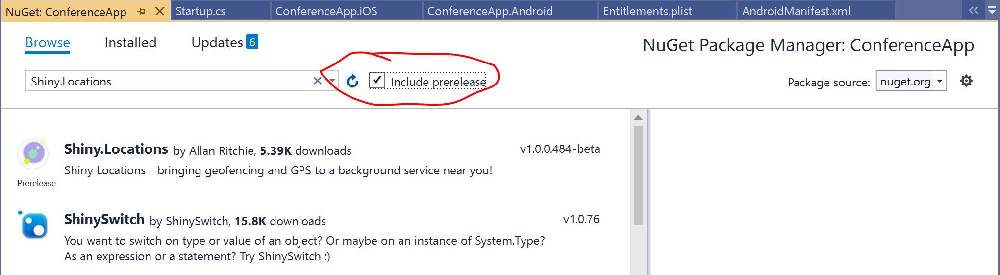

# Excersise 4 - Add notifications to your app

In this lab you will add local notifications to your app using the `Shiny.Location` and the `Shiny.Notifications` NuGet packages. We will create notifications that will trigger on location based information using geofensing and we will create notifications that are time based. More or less reminders without the use of the calendar, which we used in the previous excersises.

Goals for this lab: 
- [Setup the app to use additional Shiny NuGet Packages](#1)
- [Create notifications based on time](#2)
- [Add notifications to the background service](#3)
- [Add remote content to the notification](#4)

## Setup the app to use additional Shiny NuGet Packages

First start by adding the NuGet package `Shiny.Location` and `Shiny.Notifications` to the project `ConferenceApp`. You will find the packages by enabling the option `Include prerelease` packages with NuGet. For this ensure the following checkmark is ticked:



After adding the first package `Shiny.Notifications` it will open a readme file that contains some things you need to add to the Android and iOS project.
Ensure you install the pakages in all the project, so also in the Android and iOS projects.

First we add the following code to the `startup.cs` class found in the ConferenceApp project:

``` c#
public override void ConfigureServices(IServiceCollection services)
{
    services.UseGeofencing<LocationDelegate>();
    services.UseNotifications();

    //rest of exisiting implementation follows here....

}
```

Next we need a class that is called `LocationDelegate` that contains the implementation of the delegate that gets called the moment we enter or exit a geofence region:

``` c#
public class LocationDelegate : IGeofenceDelegate
{
    readonly INotificationManager notifications;

    public LocationDelegate(INotificationManager notifications)
    {
        this.notifications = notifications;
    }


    public async Task OnStatusChanged(GeofenceState newStatus, GeofenceRegion region)
    {
        if (newStatus == GeofenceState.Entered)
        {
            // action when entering the geofence
        }
        else
        {
            //action when exiting the geofence
        }
    }
}
```

Now we are able to respond to the events triggered by the geofence capabillities of your device.
We want to send a local notification on the device, the moment we enter or leave a geofence.
For this we use the `Shiny.location` library to send these notifications to the device.

Add the following implementation to the entering and exiting of the geofence delegate function:

``` c#
await this.notifications.Send(new Notification
{
    Title = "WELCOME!",
    Message = "you entered the geofence region " + region.Identifier
});
```

and 
``` c#
await this.notifications.Send(new Notification
{
    Title = "GOODBYE!",
    Message = "You exited the geofence region " + region.Identifier
});
```

Now we want to enable the actual execution of the code on both device platforms, for this we need to make changes to the manifests of both platform specific implementations.

### On Android
Goto the Android project and locate the file `AndroidManifest.xml` and add the following lines of xml to the end of the permissions list:

``` xml
<uses-permission android:name="android.permission.ACCESS_COARSE_LOCATION" />
<uses-permission android:name="android.permission.ACCESS_FINE_LOCATION" />
```
This now enabled access to geolocation data in your app.

### on iOS
Goto the iOS project and locate the file info.plist and open this file in the xml editor.
No add the following xml to the file to enable the use of geofencing and notifications:

``` xml
<key>UIBackgroundModes</key>
<array>
    <string>fetch</string>
<string>location</string>
</array>
<key>NSLocationAlwaysUsageDescription</key>
<string>Location is used to demo your application</string>
<key>NSLocationAlwaysAndWhenInUseUsageDescription</key>
<string>Location is used to demo your application</string>
<key>NSLocationWhenInUseUsageDescription</key>
<string>Location is used to demo your application</string>
```
## Trigger the registration of the Geofence 
Finaly we need to register the actual geofence, that will trigger the notifications. For this we will add a toolbar action to the Sessions page so we can activate the geofence and deactivate it.

Locate the page `SessionsPage.Xaml` in the `ConfenceApp` project

in this page add the following snipit of Xaml 
``` xml
<ContentPage.ToolbarItems>
    <ToolbarItem Command="{Binding SyncCommand}" Text="SYNC" />
    <ToolbarItem Command="{Binding GeofenceCommand}" Text="Geofence" />
</ContentPage.ToolbarItems>
```
and in the view model add a command handler that will do the registration the moment we touch the Geofence action

``` c#
private IAsyncCommand geofenceCommand;
public IAsyncCommand GeofenceCommand => geofenceCommand ?? (geofenceCommand = new AsyncCommand(RegisterGeofence));

private async Task RegisterGeofence()
{
    var geofences = ShinyHost.Resolve<IGeofenceManager>();
    var notifications = ShinyHost.Resolve<INotificationManager>();

    var registeredRegions = await geofences.GetMonitorRegions();

    if (registeredRegions.Count() > 0)
    {
        foreach (var region in registeredRegions)
        {
            await geofences.StopMonitoring(region.Identifier);
        }
    }
    else
    {// this is really only required on iOS, but do it to be safe
        var access = await notifications.RequestAccess();

        // now register the location and a perimeter of 200 meters
        if (access == AccessState.Available)
        {
            await geofences.StartMonitoring(new GeofenceRegion(
                "Loews Royal Pacific Resort",
                new Position(28.4687952, -81.4692212),
                Distance.FromMeters(200)
            )
            {
                NotifyOnEntry = true,
                NotifyOnExit = true,
                SingleUse = false
            });
        }
    }
}
```
## Testing this on the Android Emulator
If you use the Android emulator, make sure you can use geofencing. For your call to `StartMonitoring` to succeed, you need to first make a change in your emulator configuration.
Goto the settings of the android OS and type in `Location` next select `Location & Security`

you can on this page select  `location services` and there you see a set of providers like in the screenshot below:


Now select `Google Location Accuracy`

You will now see the following screen, where you can turn on `Improve location Accuracy` and turn this on as shown in the following screnshot:


After making this change, your call to `StartMonitoring` will succceed and you are now able to send changes to the gps location and watch the notifications appear.


