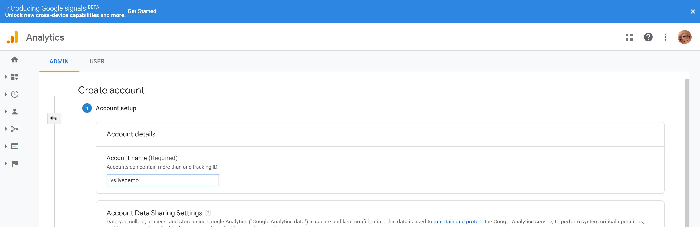
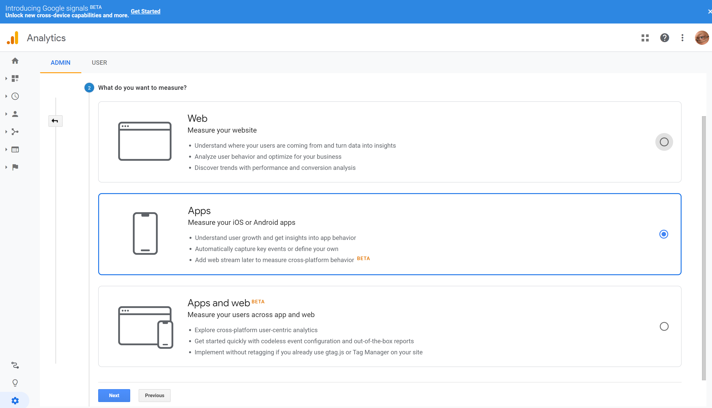
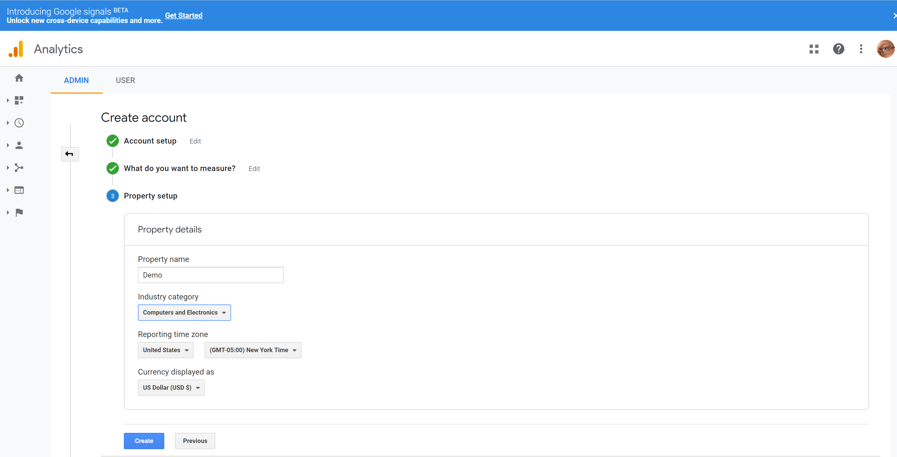

# Excerise 5 - Add analytics to your app

In this lab you will add Analytics support to your app using either google Firebase or Microsoft AppCenter.

Goals for this lab: 
- [Prepare the analytics workspace (Microsoft or Google)](#1)
- [Add the code to the app to generate analytics data for Microsoft AppCenter](#2)
- [Add the code to the app to generate analytics data for Google Firebase](#3)
- [Discover how to use the data in the various tools](#4)


## <a name="1"></a>1. Prepare the analytics workspace
We need to choose one of the various analytics tools that are available. In this lab you can find the solution how to work with either google firebase analytics or with Microsoft AppCenter analytics.

## Create a Google Analytics account
Before we can use firebase analytics, you need to have a google analytics account and property set up. This is done with the following steps:

Goto https://analytics.google.com and log in with your google account.
Next goto the admin pannel and there select the option "create analytics account".
This will result in the following page to be shown:



Give your account a name e.g. `vslivedemo` and next select what we want to measure. In our case we want to measure everyting that is happening with our mobile app, so we selct the option Mobile, as shown below:



NExt we need to define our property, this is information about our app. e.g. from which reagion are we, what currency do we use and what is the name of the property. Use for the name something like `Demo`



## Prepare a Google Firebase analytics workspace
First you need to goto the Google Firebase portal and register for your app the use of analytics. This is done by selecting analytics in the left pane and then select Enable Analysis. You can find a screenshot below:


In this screen select the Enable Google Analytics button. You will now get a screen, where you link your firebase account to Google analytics. This is the analytics we created in the previous step, so now it is just a matter of linkeng the two together.

Select in the dropdown, the analytics account you want to use, as shown below:


Now the two accounts are linked and we can now start with the generation of telemetry data. For this we need to tell our app, which account we use in firebase and analytics. For this to work, we need to save a file called `google-services.json` and we need to add this to our android project. When you add the file to your project, ensure the Build Action for this file is `GoogleServicesJson`

## Use analytics with Microsoft AppCenter
If we want to use Microsoft analytics, then we need to create an AppCenter account. If you not already own an AppCenter account, you can sign up for a free account. 

In AppCenter you need to create a new app and then do this twice. One for the android and one for the iOS app. The moment you create the app, you get access to the appcenter portal and there you can select `Analytics`

The analytics will show up here in the portal, the moment we start sending data to appcenter. You can also export the data to application insights, which is part of Azure. This creates the ability to combine telemetry from your various souces, back into one holistic view of your application, including a server side view.

# TODO:Screenshots and steps setting up appcenter

## <a name="2"></a>2. Add the code to the app to generate analytics data for Microsoft AppCenter

When we use Microsoft AppCenter, we only need to add NuGet packages to the Generic project. For this, go to the NuGet Package manager for the project `ConferenceApp`

In the Nuget package manager, select two packages: `Microsoft.Appcenter.Analytics` and `Microsoft.Appcenter.Crashes`. The moment these packages are added, we then go to the `App.cs` file and in this file we add the following lines to the method `OnStart()`

``` c#
protected override void OnStart()
{
  AppCenter.Start("android=02573986-d693-493d-b2eb-069d0a50264f;" +
                   "ios=8700101a-157b-4ff8-8b84-9dac6ec14e58;", typeof(Analytics), typeof(Crashes));
}
```

You see the guids that are used here, please replace these codes with the codes you can find in your appcenter environment. 

This line of code added crash analytics to your app and it enabled us to send telemetry as well. The registration of app start, stop etc are also registered automaticaly.

### More detailed anaytics

It is possible to add more custom telemery to the appcenter anaytics portal. For this we have a set of methods we can use on the static class called `Analytics`

Let us add a custom event, when a user is looking at the details of a specific session. We will register the session category and title, so we can e.g. determine popularity based on the number of views this training will get.

For this we make a small modification to the `SessionDetailsPage`. In the method `OnApearing` we add the tracking off the custom eent. This is done with the following lines of C# code:

``` C#
protected override void OnAppearing()
{
    base.OnAppearing();

    ((SessionDetailViewModel)BindingContext).Activate();

    Analytics.TrackEvent("session Detail", new Dictionary<string, string> {
    { "Category", ((SessionDetailViewModel)BindingContext).Session.Track},
    { "Title", ((SessionDetailViewModel)BindingContext).Session.Title},
    });
  }
```

Now try to build and run the application. Do you spot the bug we now introduced?

Apparently the calls to appcenter (and this is the same for FireBase in the next paragraph) we take too much time and the GUI will not show the details page, or will show it sporadicly. How can we solve this problem?

The way we can solve this, is to push the call to Analytics to a background thread. So the modified code that does work very nicely is shown below:

``` C#
protected override void OnAppearing()
{
    base.OnAppearing();

    ((SessionDetailViewModel)BindingContext).Activate();

    TaskFactory tf = new TaskFactory();
    tf.StartNew(() =>
    {
        Analytics.TrackEvent("session Detail", new Dictionary<string, string> {
        { "Category", ((SessionDetailViewModel)BindingContext).Session.Track},
        { "Title", ((SessionDetailViewModel)BindingContext).Session.Title},
        });
    });
}
```

## <a name="3"></a>3. Add the code to the app to generate analytics data for Google Firebase

To implement analytics using Google Firebase, we need to create a device specific implementation for both iOS and Android and we want to be able to call the Analytics code from the generic platform independend project. For this to work, we will use the standard pattern for this:

1. Create an interface that abstracts what we want to do
2. Create an implementation on Android and decorate this with the Xamarin Forms Dependency attribute
3. Create an implementation on iOS and decorate this with the Xamarin Forms Dependency attribute
4. Call the Dependency service to resolve the correct platform implementation and use the interface to log analytics data

Let's start with creating an abstraction for logging analytics data. For this we add a new interface to the project `ConferenceApp.Contracts`. The interface definition looks as follows:

``` C#
public interface IAnalyticsService
{
    void LogEvent(string eventId);
    void LogEvent(string eventId, string paramName, string value);
    void LogEvent(string eventId, IDictionary<string, string> parameters);
}
```

Now in the Android project, you add the implementation behind this interface, that uses two NuGet packages that we need to add first. The first package is called: `Xamarin.FireBase.Analytics` and `Xamarin.Firebase.Analytics.Impl` as show in the following screenshot:


Next, we create a new class `AnalyticsServiceDroid` and we place this in the Services folder in the Android project.
In this implementation you can use the following code to implement and export the interface appropriately:

``` C#
[assembly: Dependency(typeof(AnalyticsServiceDroid))]

namespace ConferenceApp.Droid.Services
{
    public class AnalyticsServiceDroid : IAnalyticsService
    {
        public void LogEvent(string eventId)
        {
            LogEvent(eventId, null);
        }

        public void LogEvent(string eventId, string paramName, string value)
        {
            LogEvent(eventId, new Dictionary<string, string>
            {
                {paramName, value}
            });
        }

        public void LogEvent(string eventId, IDictionary<string, string> parameters)
        {

            //utility method to fix eventId, you can skip it if you are sure to always pass valid eventIds
            eventId = FixEventId(eventId);

            var fireBaseAnalytics = FirebaseAnalytics.GetInstance(CrossCurrentActivity.Current.AppContext);

            if (parameters == null)
            {
                fireBaseAnalytics.LogEvent(eventId, null);
                return;
            }

            var bundle = new Bundle();

            foreach (var item in parameters)
            {
                bundle.PutString(item.Key, item.Value);
            }

            fireBaseAnalytics.LogEvent(eventId, bundle);
        }

        //utility method to fix eventId, you can skip it if you are sure to always pass valid eventIds
        private string FixEventId(string eventId)
        {
            if (string.IsNullOrWhiteSpace(eventId))
                return "unknown";

            //remove unwanted characters
            eventId = Regex.Replace(eventId, @"[^a-zA-Z0-9_]+", "_", RegexOptions.Compiled);

            //trim to 40 if needed
            return eventId.Substring(0, Math.Min(40, eventId.Length));
        }

    }
}
```

For our iOS project we need to do somethign similar. We also need to create a platform specific implementation. First we will also add a NuGet package to the iOS project called `Xamarin.FireBase.Analytics`

We need to initialize this library and therefore we need to add the follwoing line of code to the AppDelegate `FinishedLaunching` method.

``` C#
public override bool FinishedLaunching(UIApplication app, NSDictionary options)
{
    Shiny.iOSShinyHost.Init(new Startup(), builder =>
    {
        //existing injectables are here
        //....
        // now add following line:
        builder.AddTransient<IAnalyticsService, AnalyticsServiceIOS>();
    });

    // Exisiting init code
    // ....
    // Now add after the line 
    // global::Xamarin.Forms.FormsMaterial.Init();
    Firebase.Core.App.Configure();

 //   return base.FinishedLaunching(app, options);
}
```

Now the library is initialized, now we only need to write the native implementation.

This is done by adding the following class to the Services folder in your iOS project:

``` C#
[assembly: Dependency(typeof(AnalyticsServiceIOS))]

namespace MobileApp.iOS.Services
{
    public class AnalyticsServiceIOS : IAnalyticsService
    {

        public void LogEvent(string eventId)
        {
            LogEvent(eventId, (IDictionary<string, string>)null);
        }

        public void LogEvent(string eventId, string paramName, string value)
        {
            LogEvent(eventId, new Dictionary<string, string>
            {
                { paramName, value }
            });
        }

        public void LogEvent(string eventId, IDictionary<string, string> parameters)
        {

            //utility method to fix eventId, you can skip it if you are sure to always pass valid eventIds
            eventId = FixEventId(eventId);

            if (parameters == null)
            {
                Analytics.LogEvent(eventId, parameters: null);
                return;
            }

            var keys = new List<NSString>();
            var values = new List<NSString>();
            foreach (var item in parameters)
            {
                keys.Add(new NSString(item.Key));
                values.Add(new NSString(item.Value));
            }

            var parametersDictionary =
                NSDictionary<NSString, NSObject>.FromObjectsAndKeys(values.ToArray(), keys.ToArray(), keys.Count);
            Analytics.LogEvent(eventId, parametersDictionary);

        }

        //utility method to fix eventId, you can skip it if you are sure to always pass valid eventIds
        private string FixEventId(string eventId)
        {
            if (string.IsNullOrWhiteSpace(eventId))
                return "unknown";

            //remove unwanted characters
            eventId = Regex.Replace(eventId, @"[^a-zA-Z0-9_]+", "_", RegexOptions.Compiled);

            //trim to 40 if needed
            return eventId.Substring(0, Math.Min(40, eventId.Length));
        }
    }
}
```

Now we have the implementation for both platforms, the final thing we need to do is to add the code that will log the telemetry in our Forms project.

For this we goto the class `SessionDetailPage` and here we find the method: `OnAppearing()`. In this method you add the following line of code:

``` c#
var analyticsService = DependencyService.Get<IAnalyticsService>();
//You can use any of the LogEvent Overloads, for example:
analyticsService.LogEvent("Session_Detail", new Dictionary<string, string>
    {
    { "Category", ((SessionDetailViewModel)BindingContext).Session.Track},
    { "Title", ((SessionDetailViewModel)BindingContext).Session.Title},
    });
```

This now logs the session details as a custom event. 

When you build and run the application, you might find a problem with the way we implemented the call to `LogEvent`. It takes too much time and this causes the Shell not to function properly. We can solve this problem by pushing the work that is done in the `LogEvent` method to a background thread. If you change the code to the following, you will see the app is working properly again.

```C#
TaskFactory tf = new TaskFactory();
tf.StartNew(() =>
{
    var analyticsService = DependencyService.Get<IAnalyticsService>();
    //You can use any of the LogEvent Overloads, for example:
    analyticsService.LogEvent("Session_Detail", new Dictionary<string, string>
        {
        { "Category", ((SessionDetailViewModel)BindingContext).Session.Track},
        { "Title", ((SessionDetailViewModel)BindingContext).Session.Title},
        });
});
```

## <a name="2"></a>4. Discover how to use the data in the various tools

When you created the AppCenter implementation, you can go to either the Andoid or iOS app that you defined there and go to the analytics tab to view the data. You can see a screenshot below of the data that is shown after running the Android app.

# TODO: Screenshots here!!!

When you created the firebase implementation, then you could face a challenge that the event data is not shown immediately. So how can we see the event data that we send is actually received?

For Android this can be done, by issueing a command line command and tell the Android Debug tools that we are running the simulation in debug mode and we want the data to be expedited in the tools. This is done by running the following command:

`adb shell setprop debug.firebase.analytics.app com.yourcompany.conferenceapp` 

In this command `com.yourcompany.conferenceapp` is the name of your application package. You can find the correct name in your Android manifest file that can be found under the properties folder in your android project.

The same can be done in your iOS project. For this you need to specify additional startup arguments for your iOS app:
`--argument=-FIRDebugEnabled`

The moment you issue this command or set the startup argument, you can see the custom data flowing into Firebase. This is shown in below screenshot:


The standard dashboard will always show data, the above commands are only required for custom properties.

Below you can see a screenshot of the Firebase dashboard for analytics


