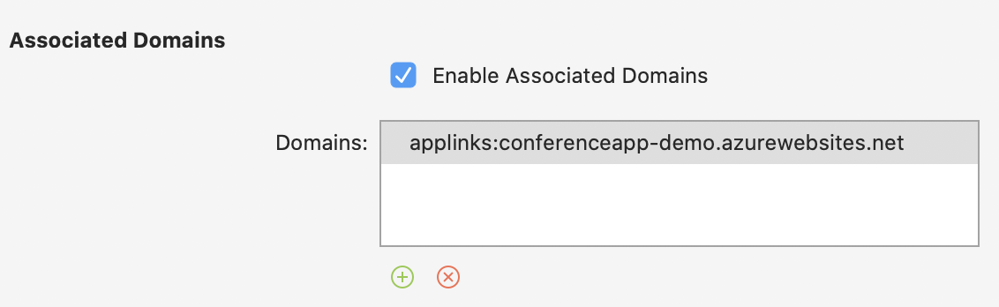

# Exercise 3 - Resilient Connected Apps

In this module, we will spice up the app a little bit with deeper OS integrations like AppLinks, haptic feedback and a widget.

## Goals for this exercise

- [Add haptic feedback to the Favorite button](#1)
- [Implement deep links and content indexing with AppLinks](#2)
- [Implement an Android Widget to complement the app](#3)

## <a nane="1"></a> Haptic feedback

Apart from only providing visual feedback, an app could also provide haptic feedback to a user when something happens or when the user performs an action. On Android, we can use the _vibrate_ function of the device, and newer iPhones (7 and up) even have a _taptic engine_, which can provide very precise haptic feedback.

Let's tap into these features.

1. In the `ConferenceApp.Contracts` project, add an interface named `IHapticFeedback`:

    ```csharp
    using System;

    namespace ConferenceApp.Contracts
    {
        public interface IHapticFeedback
        {
            void Success();
            void Error();
        }
    }
    ```

    >This interface allows us to provide two types of feedback: success or error

2. On Android, we need to give the app permission to trigger the vibration. Make sure that the `Vibrate` permission is added to the Android manifest:

    ```xml
    <uses-permission android:name="android.permission.VIBRATE" />
    ```

3. In `Services` folder of the `ConferenceApp.Android` project, add a new class named `HapticFeedback` and implement the `IHapticFeedback` interface we just created:

    ```csharp
    using System;
    using ConferenceApp.Contracts;

    namespace ConferenceApp.Droid.Services
    {
        public class HapticFeedback : IHapticFeedback
        {
            public void Error()
            {
                Xamarin.Essentials.Vibration.Vibrate(100);
            }

            public void Success()
            {
                Xamarin.Essentials.Vibration.Vibrate(10);
            }
        }
    }
    ```

    >For Android, we use the `Xamarin.Essentials.Vibration` class, which is cross platform, so it could be used in iOS as well. But for iOS, we want to leverage the _taptic engine_.

4. Also make sure that the new `HapticFeedback` class is registered in the dependency injection container. Since this is a platform specific service, we can only register it in the `MainApplication`'s `OnCreate` method:

    ```csharp
    builder.AddTransient<IHapticFeedback, HapticFeedback>();
    ```

5. In the `Services` folder of the `ConferenceApp.iOS` project, add a new class named `HapticFeedback` and implement the `IHapticFeedback` interface:

    ```csharp
    using ConferenceApp.Contracts;
    using UIKit;
    using Xamarin.Forms;

    namespace ConferenceApp.iOS.Services
    {
        public class HapticFeedback : IHapticFeedback
        {
            UINotificationFeedbackGenerator _feedback;

            public HapticFeedback()
            {
                if (UIDevice.CurrentDevice.CheckSystemVersion(10, 0))
                {
                    // The UINotificationFeedbackGenerator will use the Taptic Engine in newer iPhones
                    _feedback = new UINotificationFeedbackGenerator();
                    _feedback.Prepare();
                }
            }

            public void Success()
            {
                Device.BeginInvokeOnMainThread(() => {
                    _feedback?.NotificationOccurred(UINotificationFeedbackType.Success);
                });
            }

            public void Error()
            {
                Device.BeginInvokeOnMainThread(() => {
                    _feedback?.NotificationOccurred(UINotificationFeedbackType.Error);
                });
            }
        }
    }
    ```

    >This class uses the iOS native `UINotificationFeedbackGenerator` API. Notice that it calls `.Prepare()` in the contstructor. This is to notify the OS that it is going to invoke the taptic engine soon. Doing this will trigger the engine with lower latency.
    
    >Also note that for iOS, the `UINotificationFeedbackGenerator` needs to be invoked from the UI thread, hence the `Device.BeginInvokeOnMainThread`.

6. Also make sure that the new `HapticFeedback` class is registered in the dependency injection container. Since this is a platform specific service, we can only register it in the `AppDelegate`'s `FinishedLaunching` method:

    ```csharp
    builder.AddTransient<IHapticFeedback, HapticFeedback>();
    ```

Now we are ready to consume the `IHapticFeedback` service from the app.

7. In `SessionDetailViewModel`, add a private field to the class that will hold the reference to the `IHapticFeedback` service:

    ```csharp
    private readonly IHapticFeedback hapticFeedback;
    ```

8. Resolve the interface in the class constructor:

    ```csharp
    hapticFeedback = ShinyHost.Resolve<IHapticFeedback>();
    ```

7. In `SessionDetailViewModel`, find the `IsFavorite` property setter and add a call to the `hapticFeedback` service:

    ```csharp
    hapticFeedback.Success();
    ```

    >This can only be tested on a physical device

## <a nane="2"></a> Deep links and content indexing with AppLinks

`AppLinks` is a Xamarin.Forms abstraction over a few different features that are related but slightly different:

- *Content indexing* - we can use `AppLinks` to add content to on-device search results
- *UI Activity* - on iOS, we can integrate with the `UIActivity` features, to provide context to the OS on what the user is currently doing
- *Deep linking* - using `http(s)` or a custom url scheme, we can deep link into our app from the outside

We will add `AppLinks` to the Conference App too.

1. For the `ConferenceApp.Android` project, we need to add a Nuget package:

    ```
    Xamarin.Forms.AppLinks
    ```

    >This will add some middleware to the project, as well as the app indexing libraries for Google's `Firebase`, which are needed for deep linking to work on Android.

2. The `ConferenceApp.Android` project in the lab files already contains a `google-services.json` file, linked to our own `Firebase` project. For your own app, you will need to register and add your own. Make sure that the `Build Action` of this file is set to `GoogleServicesJson`, so that the Android build tool can generate the required bindings and code.

3. Add a `const string` value to the `MainActivity` class in Android:

    ```csharp
    const string APPLINK_DATAHOST = "conferenceapp-demo.azurewebsites.net";
    ```

4. Now we have to register `IntentFilter`s so that Android knows that our app can "listen" to deep link urls. Annotate the `MainActivity` with these attributes:

    ```csharp
    [IntentFilter(new[] { Android.Content.Intent.ActionView },
                   Categories = new[]
                   {
                            Android.Content.Intent.CategoryDefault,
                            Android.Content.Intent.CategoryBrowsable
                   },
                   DataScheme = "http", DataHost = APPLINK_DATAHOST, DataPathPrefix = "/sessions/", AutoVerify = true)]
    [IntentFilter(new[] { Android.Content.Intent.ActionView },
                   Categories = new[]
                   {
                            Android.Content.Intent.CategoryDefault,
                            Android.Content.Intent.CategoryBrowsable
                   },
                   DataScheme = "https", DataHost = APPLINK_DATAHOST, DataPathPrefix = "/sessions/", AutoVerify = true)]
    [IntentFilter(new[] { Android.Content.Intent.ActionView },
                   Categories = new[]
                   {
                            Android.Content.Intent.CategoryDefault,
                            Android.Content.Intent.CategoryBrowsable
                   },
                   DataScheme = "http", DataHost = APPLINK_DATAHOST, DataPathPrefix = "/speakers/", AutoVerify = true)]
    [IntentFilter(new[] { Android.Content.Intent.ActionView },
                   Categories = new[]
                   {
                            Android.Content.Intent.CategoryDefault,
                            Android.Content.Intent.CategoryBrowsable
                   },
                   DataScheme = "https", DataHost = APPLINK_DATAHOST, DataPathPrefix = "/speakers/", AutoVerify = true)]
    ```

    >Note that we are registering both `/speakers/` and `/sessions/` with two different `DataScheme`s: `http` and `https`. You can also choose to introduce your own URI scheme, however we will see why it makes sense to use `http(s)` later.

In iOS, we don't need to do anything special (yet).

Now we want to index all the sessions that the user has looked at in the app, so that the user can find that session back when searching on the device (using Google on Android or Spotlight on iOS).

5. In `SessionDetailViewModel`, add a new method called `RegisterAppLink`:

    ```csharp
    private void RegisterAppLink(bool active)
    {
        var entry = new AppLinkEntry
        {
            Title = Session.Title,
            StyleId = Session.Id,
            AppLinkUri = new Uri($"{App.AppLinkBaseUri}/sessions/sessiondetail?sessionId={Uri.EscapeDataString(Session.Id)}", UriKind.RelativeOrAbsolute),
            Description = Session.IsServiceSession ? "Service session" : Session.Description,
            IsLinkActive = active
        };

        // These are parameters that are shown in the search (especially the AppName)
        entry.KeyValues.Add("contentType", "Session");
        entry.KeyValues.Add("companyName", "VSLive");
        entry.KeyValues.Add("appName", "ConferenceApp");

        Application.Current.AppLinks.RegisterLink(entry);
    }
    ```

    >This will create an `AppLinkEntry` with the required properties for iOS to index it in Spotlight search. Also note that there is a property named `IsLinkActive` in the `AppLinkEntry`. This indcates to the OS whether the user is currently interacting with this particular item. The metadata in the `AppLinkEntry` provides context to the item. In this case, we know that it is a `Session` provided by the `ConferenceApp`, and it has a unique URI.

6. Find the `GetSelectedSession` method, and add a call to `RegisterAppLink` at the end of that method

    ```csharp
    RegisterAppLink(active: true);
    ```

    >Since this is the moment where the session is loaded into the view model, we signal that the current item is active.

7. Override the `Deactivate` method and add a call to `RegisterAppLink`:

    ```csharp
    RegisterAppLink(active: true);
    ```

    >When the view model is deactivated, it means that the user is leaving the current context. We therefore mark the link as inactive (`active: false`)

Launch the app and visit a few session detail pages. Return to the home screen and search for a word in one of the session titles (or description) that you have visited. The sessions should now pop up in the search result.

However, when we click the search result, we are not taken to that session yet. We need one more step for that:

8. In `App.xaml.cs` in the `ConferenceApp` project, add a `const string` field to the `App` class:

    ```csharp
     public const string AppLinkBaseUri = "https://conferenceapp-demo.azurewebsites.net";
    ```

9. Override the `OnAppLinkRequestReceived` method and add the following code:

    ```csharp
    protected override void OnAppLinkRequestReceived(Uri uri)
    {
        // need to prefix the uri with "/" so that the root becomes "//"
        var appShellUri = "/" + uri.PathAndQuery;
        Shell.Current.GoToAsync(appShellUri, animate: true)
            .SafeFireAndForget(onException: ex =>
            {
                Console.WriteLine($"An error occurred while navigating to deeplink: {appShellUri}, {ex}");
            });

        base.OnAppLinkRequestReceived(uri);
    }
    ```

    >Here, we use the `Shell`'s URI based deep link navigation feature to send the user to the correct page. Note that the URI matches the `route` names that we registered in the `Shell`, so we can directly navigate to the correct page.

    >For example, a deeplink like `https://conferenceapp-web.azurewebsites.net/sessions/sessiondetail?sessionId=1` will navigate to the `Shell` URI: `//sessions/sessiondetail?sessionId=1`

Finally, `AppLinks` can also be used for integration between your website and your app. For example, the url `https://conferenceapp-web.azurewebsites.net/sessions/sessiondetail?sessionId=1` is an actual web page on our Conference App web backend. By associating this domain and url scheme to our apps, we can let both Android and iOS open the app instead of the web page, whenever the user encounters such a link.

#### Android

In Android, we have added our `IntentFilter`s to listen to urls matching the scheme and domain mentioned above. Notice the last parameter of these `IntentFilter` attributes:

    ```csharp
    [IntentFilter(new[] { Android.Content.Intent.ActionView },
                Categories = new[]
                {
                        Android.Content.Intent.CategoryDefault,
                        Android.Content.Intent.CategoryBrowsable
                },
                DataScheme = "https", DataHost = APPLINK_DATAHOST, DataPathPrefix = "/speakers/", AutoVerify = true)]
    ```

>`AutoVerify = true` means that Android will automatically verify whether the data scheme, domain name and path actually belong with the app. It will do so by requesting a file named `/.well-known/assetlinks.json` from the server, which looks like this:

```json
[
    {
        "relation": [ "delegate_permission/common.handle_all_urls" ],
        "target": {
        "namespace": "android_app",
        "package_name": "com.yourcompany.conferenceapp",
        "sha256_cert_fingerprints": [ "07:24:CD:C8:1D:9C:50:09:05:88:A1:4F:47:6C:7F:3F:3D:97:CF:F2:DA:60:B7:86:62:D1:65:05:C1:79:DD:65" ]
        }
    }
]
```

Android checks whether this file exists on the server, and whether the `package_name` and `sha256_cert_fingerprints` match those of the app. If so, it knows it can open those url's in the app through a deep link.

#### iOS

iOS works in a similar way. If we set up our app and website correctly, we can let iOS know that they belong together. This is difficult to practice in a Hands-On-Labs setup, since you need provisioning profiles to sign the app with, and you need these profiles to include the device ID of your physical device.

First, we need to add an entitlement to the `Entitlements.plist` file in the `ConferenceApp.iOS` project. This entitlement must also be enabled in the Apple Developer Portal, so that it is included in the provisioning profile. The entitlement is called `Associated Domains`:



The domain of our website needs to be added to the list of domains, with the `applinks:` prefix:

`applinks:conferenceapp-demo.azurewebsites.net`

On this website, iOS will search for a file named `/.well-known/apple-app-site-association` (no extension), which looks like this:

```json
{
    "applinks": {
        "apps": [],
        "details": [
            {
                "appID": "39PT865AX5.com.yourcompany.ConferenceApp",
                "paths": [ "/sessions/*", "/speakers/*" ]
            }
        ]
    }
}
```

Similar to Android, the `appID` must match that of the app, including the App ID prefix. Furthermore, this file indicates that the app should handle urls that start with `/sessions` or `/speakers`.

Now when you browse the website and land on a session's page, iOS should suggest to open the app instead, and it will take you to deep link in the app.

## <a nane="3"></a> Android Widget

We will add a Widget to the Android app which displays the next "favorite" session on the home screen. This way, you can see where to go next without opening the app.

1. First we need to define the widget with some metadata, by adding an `appwidgetprovider.xml` file to the `Resources\xml` folder:

    ```xml
    <?xml version="1.0" encoding="UTF-8" ?>
    <appwidget-provider xmlns:android="http://schemas.android.com/apk/res/android"
    android:minWidth="288dip"
    android:minHeight="72dip"
    android:resizeMode="horizontal"
    android:minResizeWidth="144dip"
    android:updatePeriodMillis="30000"
    android:initialLayout="@layout/Widget"
    android:previewImage="@drawable/previewImage"
    />
    ```

    >This file describes the widget, its dimensions, orientation and the update interval. Note that the update interval is a minimum of 30 minutes on Android. Also, the metadata points to a `Layout` called `Widget`, which should be used as the initial layout. There is also a `previewImage`, which will be displayed when the widget is dragged onto the user's home screen. In our case, it is just a Xamarin logo.

2. In `Resources\layout`, add a new Android Layout called `Widget.axml`:

    ```xml
    <?xml version="1.0" encoding="utf-8"?>
    <LinearLayout android:backgroundTint="@android:color/background_light" xmlns:android="http://schemas.android.com/apk/res/android" android:orientation="vertical" android:layout_width="match_parent" android:layout_height="match_parent" android:id="@+id/widgetBackground">
        <TextView
            android:text="Large Text"
            android:textAppearance="?android:attr/textAppearanceLarge"
            android:layout_width="match_parent"
            android:layout_height="wrap_content"
            android:minWidth="25px"
            android:minHeight="25px"
            android:id="@+id/titleView" />
        <TextView
            android:text="Medium Text"
            android:textAppearance="?android:attr/textAppearanceMedium"
            android:layout_width="match_parent"
            android:layout_height="wrap_content"
            android:id="@+id/timeAndLocationView" />
    </LinearLayout>
    ```

    >This is a very simple layout with two labels, which will show the title and the time/location of the session.

3. Now implement the widget by adding a class named `MySessionsWidget` to the `ConferenceApp.Android` project:

    ```csharp
    [BroadcastReceiver(Label = "My Sessions - Conference App")]
    [IntentFilter(new string[] { "android.appwidget.action.APPWIDGET_UPDATE" })]
    [MetaData("android.appwidget.provider", Resource = "@xml/appwidgetprovider")]
    public class MySessionsWidget : AppWidgetProvider
    {

    }
    ```

    >The class registers itself as a widget provider, and also registers to listen to an `Intent` of type `android.appwidget.action.APPWIDGET_UPDATE`. This is invoked whenever the OS (or the app) wants to update the widget.

4. Next, we need to build the UI for the widget, so that we can send it to the Android OS for display. In Android, we call this `RemoteViews`. Add the following method to the `MySessionsWidget` class:

    ```csharp
    public RemoteViews BuildRemoteViews(Context context, int[] appWidgetIds)
    {
        var store = ShinyHost.Resolve<IConferenceStore>();

        var sessions = store.GetSessions().GetAwaiter().GetResult();
        var myNextSession = sessions.FirstOrDefault(s => s.IsFavorite);

        var views = new RemoteViews(context.PackageName, Resource.Layout.Widget);

        if (myNextSession != null)
        {
            views.SetTextViewText(Resource.Id.titleView, myNextSession.Title);
            views.SetTextViewText(Resource.Id.timeAndLocationView, $"{myNextSession.StartsAt.ToLocalTime():t} - {myNextSession.EndsAt.ToLocalTime():t} in {myNextSession.Room}");
        }
        else
        {
            views.SetTextViewText(Resource.Id.titleView, "No session available");
            views.SetTextViewText(Resource.Id.timeAndLocationView, "You have not favorited any sessions");
        }

        return views;
    }
    ```

    >First, the first session in the list that is favorited is retrieved. A new `RemoteViews` object is created, using the `Widget` layout we just crated. The title and time/location of the session are set on the `TextView`s of the widget. The `RemoteViews` object is now ready to be pushed to the widget.

5. Whenever the widget needs to be updated (through the broadcast event of the `android.appwidget.action.APPWIDGET_UPDATE` intent), we need to send this updated view to the widget. Override the `OnUpdate` method in the `MySessionsWidget` class:

    ```csharp
    public override void OnUpdate(Context context, AppWidgetManager appWidgetManager, int[] appWidgetIds)
    {
        var me = new ComponentName(context, Java.Lang.Class.FromType(typeof(MySessionsWidget)).Name);
        appWidgetManager.UpdateAppWidget(me, BuildRemoteViews(context, appWidgetIds));
    }
    ```

By default, Android will only update widgets once every 30 minutes. So if you want your widget to update more often, you have to initiate this from the app (for example from a background job). We can also cheat by adding a click handler to the widget to trigger the update.

6. Add a method named `RegisterClicks` to the `MySessionsWidget` class:

    ```csharp
     private void RegisterClicks(Context context, RemoteViews widgetView, int[] appWidgetIds)
    {
        var intent = new Intent(context, typeof(MySessionsWidget));
        intent.SetAction(AppWidgetManager.ActionAppwidgetUpdate);
        intent.PutExtra(AppWidgetManager.ExtraAppwidgetIds, appWidgetIds);

        // Register click event for the Background view of the widget
        var piBackground = PendingIntent.GetBroadcast(context, 0, intent, PendingIntentFlags.UpdateCurrent);
        widgetView.SetOnClickPendingIntent(Resource.Id.widgetBackground, piBackground);
    }
    ```

    >When the widget is clicked, it will send an `Intent` with an `ActionAppwidgetUpdate` payload to itself, triggering the update cycle.

7. Call the `RegisterClicks` method from `BuildRemoteViews`, just after creating the `RemoteViews` object:

    ```csharp
    RegisterClicks(context, views, appWidgetIds);
    ```

Install the application on your emulator or device, and long press the app icon. A popup menu should appear with `App Widgets`. You should be able to install the widget on the home screen and see it update.

If you have not favorited any session yet, go into the app and favorite one. When you return to the home screen, and tap the widget, it should update and show the session you just favorited.